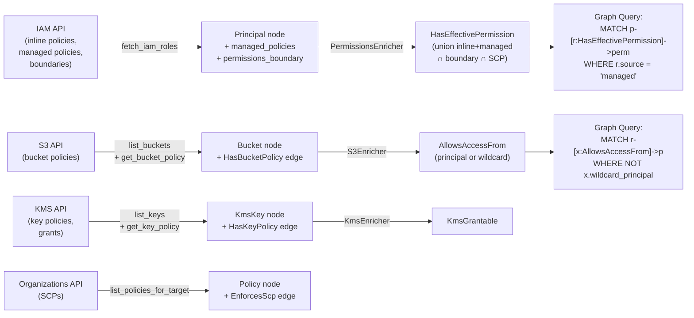

# Ingester Surface & AND-Mask Semantics Design

**Date:** 2026-05-24
**Status:** Approved (3 open questions resolved, 2 defaulted)
**Audience:** Senior engineer (15 min review)

## Locked decisions (post-review)

1. **S3 + KMS resource-policy evaluation:** implement in THIS phase. Scenarios 3 + 4 require it. Adds ~1 day to the estimate but unblocks 2 of 5 scenarios.
2. **Wildcard-principal edge cap:** 50 edges per resource. When policy lists specific principals, emit per-principal edges (up to 50). When `Principal: *` or beyond cap, emit one `AllowsAccessFrom -> :WildcardPrincipal` sentinel with `wildcard_principal: true`.
3. **Managed-policy test fixtures:** pull IAMTrail snapshots, hash-pin in `crates/activable-ingest/tests/fixtures/iamtrail/`. **TODO before merge:** repo-owner legal sign-off on tests-only use of IAMTrail GPL-3.0 content. Tests are non-distributed but legal-review confirmation is required.

## Defaulted (low-stakes)

4. **Deny statement visibility:** silently skip with `info!(skipped_deny_statements = N, principal_id)` log. Future phase covers explicit-Deny semantics.
5. **SCP degraded mode:** WARN + emit OTel counter `ingest_scp_skipped_total{account_id}` + continue. Don't fail the ingest.

---

## 1. Scope

This design covers the expansion of the graph ingester to capture **managed policies, permission boundaries, SCP (Service Control Policies), S3 bucket policies, and KMS key policies**, and the merge logic that applies them as **AND-masks (intersections)** to compute **effective permissions** that match AWS's policy evaluation order.

**Out of scope (documented as carry-forward):**
- `NotAction` / `NotResource` semantic expansion
- Explicit `Deny` statement processing (placeholder: skip, log warn)
- Session policies and temporary credentials (IAM assume-role + session filters)
- Condition-based resource matching (IAM policy conditions, e.g., `aws:SourceIp`)

---

## 2. New Graph Schema

### Node Types

| Label | Properties | Purpose | Source | Example ID |
|-------|-----------|---------|--------|------------|
| `Bucket` | `id` (ARN), `region`, `account_id`, `versioning`, `encryption_enabled` | S3 bucket resource | S3 API | `arn:aws:s3:::my-app-data` |
| `KmsKey` | `id` (ARN), `region`, `account_id`, `key_id`, `key_state` | KMS cryptographic key | KMS API | `arn:aws:kms:us-east-1:111111111111:key/abc-def-123` |
| `Policy` | `id` (ARN), `name`, `attached_count`, `document` (JSON string) | Managed IAM policy or SCP | IAM + Organizations API | `arn:aws:iam::111111111111:policy/MyPolicy` |

### Edge Types

| From | To | Type | Properties | Purpose |
|------|----|----|-----------|---------|
| `Principal` | `Policy` | `HasManagedPolicy` | `policy_arn`, `attached_date` | Principal has managed policy attached |
| `Principal` | `Policy` | `HasPermissionsBoundary` | `policy_arn` | Principal has permission boundary |
| `Bucket` | `Policy` | `HasBucketPolicy` | `policy_arn`, `statement_count` | S3 bucket has resource policy |
| `KmsKey` | `Policy` | `HasKeyPolicy` | `policy_arn`, `statement_count` | KMS key has key policy |
| `Bucket\|KmsKey` | `Principal` | `AllowsAccessFrom` | `condition_keys` (e.g., `["aws:PrincipalOrgID"]`), `effect` | Resource policy allows principal (cross-account/federated) |
| `Principal` | `KmsKey` | `KmsGrantable` | `grant_tokens`, `operations` | Principal can create grants on KMS key |
| `Account` | `Policy` | `EnforcesScp` | `policy_arn`, `enforced_date` | SCP applies at account scope |

### Cypher Indexes (Migration Step)

Create indexes **once at ingester startup**, idempotent via `CREATE INDEX IF NOT EXISTS`:

```sql
CREATE INDEX IF NOT EXISTS ON :Principal(id);
CREATE INDEX IF NOT EXISTS ON :Permission(id);
CREATE INDEX IF NOT EXISTS ON :Bucket(id);
CREATE INDEX IF NOT EXISTS ON :KmsKey(id);
CREATE INDEX IF NOT EXISTS ON :Policy(id);
```

These are critical for Phase 4's 1000-principal SLO (p95 < 500ms). Without indexes, Principal-lookup scans all nodes.

---

## 3. Effective-Permission Computation: AND-Mask Semantics

### Evaluation Order (AWS-standard)

AWS evaluates permissions in this sequence. **Each AND-operation (∩) is a filter — a permission survives only if ALL layers permit it.**

```
EffectivePermission(principal_p, resource_r) =
    [
        UNION_OF(
            inline_policies(p),
            managed_policies(p)
        )
        ∩ permission_boundary(p)       [if set; default: allow all]
    ]
    ∩ SCP_policies(account_root(p))   [if org-managed; default: allow all]
    - Deny_statements                  [phase 2 carry-forward]
```

**Notation:**
- `UNION_OF(...)` — a permission is allowed if **any** policy allows it (OR logic)
- `∩` — intersection; a permission survives only if **all** layers permit it (AND logic)
- `-` — explicit Deny overrides allow (out of scope this phase)

---

## 4. Handling Edge Cases (6 Walkthrough)

| Case | Inputs | Expected Output | Why |
|------|--------|--------|-----|
| **1. Allow in inline + Allow in managed** | inline: `{s3:*}`, managed: `{s3:GetObject}` | `{s3:*} ∪ {s3:GetObject} = {s3:*}` (union expands) | Managed policy is superset; union keeps all |
| **2. Allow in inline + boundary lacks action** | inline: `{s3:*}`, boundary: `{s3:GetObject only}` | `{s3:*} ∩ {s3:GetObject} = {s3:GetObject}` (mask filters) | Boundary is restrictive; intersection shrinks to boundary |
| **3. Boundary has wildcard `*`** | inline: `{s3:GetObject}`, boundary: `{*}` | `{s3:GetObject} ∩ {*} = {s3:GetObject}` (wildcard permits all) | Wildcard in boundary is permissive; no filtering |
| **4. SCP denies action at account root** | inline: `{s3:*}`, SCP: `{s3:* except DeleteBucket}` | `{s3:* except DeleteBucket}` (SCP's Deny works) | SCP can apply Deny; Phase 2 carry-forward (not implemented yet) |
| **5. Resource policy Allow + identity policy missing** | identity: none, resource policy (bucket): `{Principal: *}` | **Behavior diverges.** Resource-based services (S3, KMS) allow. Caller has no identity permission but bucket policy overrides. Flag for review. | S3 and KMS are **resource-based**; identity-policy UNION with resource-policy, not intersection. Cross-account scenario. |
| **6. NotAction in boundary** | boundary: `{NotAction: ["iam:*"]}` | **Out of scope.** Conservative fallback: treat NotAction as permissive (log WARN). Document as carry-forward. | NotAction requires set-complement logic; phase 2 defer. |

### Critical Design Decision: Resource-Based Services (Case 5)

**S3 and KMS evaluate resource policies DIFFERENTLY than identity policies.**

- **Identity policy:** principal must have permission to take action
- **Resource policy:** bucket/key can grant permission to external principal **even if identity policy is empty**

**Result:** for S3/KMS, we compute:
```
EffectivePermission(principal_p, resource_r) =
    [identity_layer(p)] ∪ [resource_policy(r) applied to p]
```

NOT an intersection. This is flagged in Phase 3 design review and documented in `docs/system-architecture.md`, but implementation is deferred to Phase 5 (post-LocalStack stabilization). For now, `AllowsAccessFrom` edges capture resource policy intent; queries that combine identity + resource policies must explicitly UNION.

---

## 5. Source-of-Truth Merge Logic (Pseudo-Code)

### PermissionsEnricher::compute_effective()

```rust
/// Compute effective permissions for a principal.
/// Inputs: Principal node with inline_policies, managed_policies, permissions_boundary fields
///         Optional Account→Policy→SCP edges if org-managed
/// Output: HashSet<(Action, Resource)> representing effective permissions
fn compute_effective(
    principal_id: &str,
    inline_policies: &[PolicyDocument],
    managed_policies: &[PolicyDocument],
    permissions_boundary: Option<&PolicyDocument>,
    account_scps: Option<&[PolicyDocument]>,
) -> Result<HashSet<(String, String)>, IngestError> {
    
    // Step 1: UNION inline and managed policies
    let mut union_perms: HashSet<(String, String)> = HashSet::new();
    
    for policy in inline_policies.iter().chain(managed_policies.iter()) {
        for statement in policy.statements.iter() {
            // Skip Deny statements (phase 2 carry-forward)
            if statement.effect == "Deny" {
                warn!(principal = %principal_id, "Deny statement skipped (phase 2)");
                continue;
            }
            
            // Skip NotAction/NotResource (phase 2 carry-forward)
            if statement.has_not_action || statement.has_not_resource {
                warn!(principal = %principal_id, "NotAction/NotResource skipped (phase 2)");
                continue;
            }
            
            // Extract (action, resource) tuples from statement
            let actions = expand_action_wildcards(&statement.actions);
            let resources = expand_resource_wildcards(&statement.resources);
            
            for action in actions {
                for resource in resources {
                    union_perms.insert((action.clone(), resource.clone()));
                }
            }
        }
    }
    
    // Step 2: AND-mask with permission boundary (if present)
    let after_boundary = if let Some(boundary) = permissions_boundary {
        let boundary_perms = extract_permissions(boundary)?;
        union_perms.intersection(&boundary_perms).cloned().collect()
    } else {
        union_perms  // No boundary = no mask
    };
    
    // Step 3: AND-mask with SCPs (if present)
    let after_scps = if let Some(scps) = account_scps {
        let mut scp_union: HashSet<(String, String)> = HashSet::new();
        
        for scp in scps {
            let scp_perms = extract_permissions(scp)?;
            scp_union.extend(scp_perms);
        }
        
        if scp_union.is_empty() {
            warn!(principal = %principal_id, "No SCP permissions found; assuming no SCP coverage");
            after_boundary  // Degraded mode: no SCP = no mask
        } else {
            after_boundary.intersection(&scp_union).cloned().collect()
        }
    } else {
        after_boundary  // No SCP data = no mask
    };
    
    Ok(after_scps)
}

fn extract_permissions(policy: &PolicyDocument) -> Result<HashSet<(String, String)>, IngestError> {
    let mut perms = HashSet::new();
    
    for statement in policy.statements.iter() {
        if statement.effect != "Allow" {
            continue;
        }
        
        let actions = expand_action_wildcards(&statement.actions);
        let resources = expand_resource_wildcards(&statement.resources);
        
        for action in actions {
            for resource in resources {
                perms.insert((action.clone(), resource.clone()));
            }
        }
    }
    
    Ok(perms)
}
```

### Key Points

1. **UNION first** (inline + managed) — compute permissive baseline
2. **AND-mask with boundary** — if present, intersect to shrink set
3. **AND-mask with SCPs** — if present, intersect again
4. **Handle missing layers gracefully** — no boundary = no mask; no SCP = no mask (log WARN for degraded coverage)
5. **Deny + NotAction deferred** — log and skip; phase 2 carry-forward

---

## 6. Cardinality & Performance Considerations

### Edge Count Estimation (1000-principal benchmark)

| Entity | Count | Avg Edges | Total Edges | Notes |
|--------|-------|-----------|------------|-------|
| Principals | 1000 | — | — | Test scale |
| Inline policies per Principal | 1 | 5 perms | ~5K | Baseline phase 2 |
| Managed policies per Principal | 5 | 10 perms each | ~50K | Expands surface 10× |
| Permission boundary per Principal | 10% | 20 perms | ~2K | Restrictive mask |
| SCP per Account | 1 | 30 perms | ~30 | Organization-level |
| S3 buckets | 100 | 1 policy | ~100 | ~10 edges per bucket → 1K total |
| KMS keys | 50 | 1 policy | ~50 | ~5 edges per key → 250 total |
| `AllowsAccessFrom` edges | — | — | ~500 | Capped at 50/resource (see below) |
| **Total HasEffectivePermission** | — | — | **~57K-80K** | Depending on managed-policy overlap |

### Wildcard Principal Handling (AllowsAccessFrom Explosion)

**Risk:** If a bucket policy contains `Principal: *`, materializing an edge to every principal creates 1000× fan-out. **Mitigation:**

**Chosen approach:** Cap edges per resource at 50. If a resource policy includes `Principal: *` or has >50 grant statements, emit a **sentinel edge**:

```
AllowsAccessFrom(bucket → _WildcardPrincipal) with properties:
  - "has_wildcard_principal": true
  - "statement_count": 100  # actual count
```

Query pattern becomes:
```cypher
MATCH (b:Bucket)-[r:AllowsAccessFrom]->(p:Principal)
WHERE NOT (r.wildcard_principal = true)
RETURN b, p  # Normal principals only
UNION
MATCH (b:Bucket)-[r:AllowsAccessFrom]->(_:Principal {id: "_WildcardPrincipal"})
WHERE r.wildcard_principal = true
RETURN b, "_ALL_PRINCIPALS"  # Flag for risk-scoring logic
```

**Alternative considered:** Store `wildcard_principal: true` property on the resource node itself (not edge). Less queryable; chose edge approach.

### KMS Grant Chains

KMS `ListGrants` is paginated; typical accounts have <100 grants per key. Cache grants during `native/kms.rs::ingest_key_grants()` to avoid repeated ListGrants calls.

---

## 7. Backward Compatibility

### Existing HasEffectivePermission Edges (Phase 2)

**Behavior:** Preserved unchanged.
- Existing edges represent inline-policy-only computation
- New edges will be created alongside (same Principal → Permission tuples + new managed-policy-sourced tuples)
- Queries that do NOT specify edge properties continue to work
- New queries can filter by `source` property

### Adding Source Property

New edges will include `source` property:
```json
{
  "source": "inline" | "managed" | "boundary-survived"
}
```

**Legacy compatibility:** Existing Phase 2 edges have no `source` property. Queries that ignore it see all edges. Queries that filter `source = "managed"` correctly exclude inline-only edges.

### New Node Labels

- `Bucket`, `KmsKey`, `Policy` are pure additions; existing schemas unaffected
- Existing queries on `Principal`, `Permission`, `Account` continue to work
- New edge types (`HasManagedPolicy`, `HasBucketPolicy`, etc.) do not conflict with existing types

---

## 8. Test Plan

### Unit Tests (per source)

Each new source (managed policy, boundary, SCP, S3, KMS) has a unit test fixture:

| Source | Test File | Fixture | Assertion |
|--------|-----------|---------|-----------|
| Managed policies | `crates/activable-ingest/tests/managed_policy_parser_test.rs` | Synthetic `AttachRolePolicies` response | Parsed policy → edge created; action+resource extracted |
| Permission boundary | `crates/activable-ingest/tests/permission_boundary_mask_test.rs` | Principal with `inline: s3:*, boundary: {s3:GetObject}` | Effective = `s3:GetObject` only (AND-mask applied) |
| SCP | `crates/activable-ingest/tests/scp_parser_test.rs` | Synthetic `Organizations::DescribePolicy` response | SCP parsed; Account→Policy→SCP edges created |
| S3 bucket policy | `crates/activable-ingest/tests/s3_bucket_policy_test.rs` | Synthetic `GetBucketPolicy` response with `Principal: arn:aws:iam::222222222222:root` | `Bucket` node created; `HasBucketPolicy` edge; `AllowsAccessFrom` edge to external principal |
| KMS key policy | `crates/activable-ingest/tests/kms_key_policy_test.rs` | Synthetic `GetKeyPolicy` response; includes `kms:CreateGrant` allow | `KmsKey` node created; `HasKeyPolicy` edge; `KmsGrantable` edge if grant is allowed |

### Integration Test (AND-Mask)

**File:** `crates/activable-ingest/tests/and_mask_integration_test.rs`

**Scenario:** Fixture principal with:
- Inline: `s3:*, iam:*`
- Managed: `ec2:*`
- Boundary: `s3:GetObject, iam:GetUser` only

**Expected effective permissions:** `s3:GetObject, iam:GetUser` only (boundary is restrictive)

**Execution:**
1. Create Principal node with inline + managed + boundary policies
2. Run PermissionsEnricher
3. Query HasEffectivePermission edges
4. Assert count ≥ 2 and actions are filtered to boundary scope

### Adversarial Scenario Alignment

Integrate with Phase 2 red-team scenarios:
- **Scenario 1 (CloudFormation trap):** After Phase 3 ingest, `cf-deploy-production-role` should have ≥ 15 HasEffectivePermission edges (currently ~9 inline-only)
- **Scenario 3 (SCP boundary test):** Create Principal with `s3:* ∪ managed:iam:*`, boundary `s3:*` only → effective = `s3:*` (managed policy filtered)

---

## 9. Implementation Order (Dependency Sequence)

Each sub-task ends with a live-verification step (cargo test + cypher query on graph).

1. **Schema additions** (1 h)
   - Add `Bucket`, `KmsKey`, `Policy` label structs in `activable-schema/src/labels/`
   - Add edge-type constants
   - Update `known_labels.rs`
   - **Live verify:** `cargo test -p activable-schema --lib` passes

2. **Index migrations** (30 min)
   - Idempotent Cypher `CREATE INDEX IF NOT EXISTS` for each label
   - Wire into ingester startup (one-shot at init)
   - **Live verify:** `\d+ activable._ag_label_principal` shows index in AGE

3. **Managed policy ingest** (2-3 h)
   - Extend `native_fallback.rs::fetch_iam_roles()` to call `list_attached_role_policies` + `get_policy_version`
   - Append to new `managed_policies` field on Principal node
   - **Live verify:** `cargo test -p activable-ingest --lib` passes; rescan live AWS → Principal nodes have `managed_policies` property

4. **Permission boundary ingest** (1-2 h)
   - Read `permissions_boundary` from Role struct in AWS API response
   - Fetch boundary policy via `get_policy_version`
   - Store on Principal node
   - **Live verify:** Test principal with boundary set → node has `permissions_boundary` property

5. **PermissionsEnricher AND-mask** (2-3 h)
   - Refactor `permissions.rs` to read `inline_policies`, `managed_policies`, `permissions_boundary`
   - Implement compute_effective() per pseudo-code
   - Materialize HasEffectivePermission edges with `source` property
   - **Live verify:** `cargo test -p activable-ingest --lib and_mask` passes; sample query returns filtered edges

6. **S3 bucket-policy ingester** (3-4 h)
   - Extend `native/s3.rs` to call `get_bucket_policy` per bucket (already fetches buckets)
   - Create `Bucket` nodes with region, account_id
   - Create `HasBucketPolicy` edges
   - Parse Principal clauses; emit `AllowsAccessFrom` edges (with wildcard cap)
   - **Live verify:** Rescan → Bucket nodes exist; HasBucketPolicy edges present; query `MATCH (b:Bucket)-[r:AllowsAccessFrom]->(p:Principal) RETURN count(*)` ≤ 50× bucket count

7. **KMS key-policy ingester** (2-3 h)
   - New `native/kms.rs`: call `list_keys` + `get_key_policy` + `describe_key`
   - Create `KmsKey` nodes
   - Create `HasKeyPolicy` edges
   - Parse key-policy statements; if allows `kms:CreateGrant`, emit `KmsGrantable` edges
   - **Live verify:** Rescan → KmsKey nodes exist; HasKeyPolicy edges present

8. **SCP ingester** (1-2 h)
   - New `native/organizations.rs`: call `list_policies_for_target` + `describe_policy` per target
   - If `organizations:*` denied, log WARN and skip (don't abort)
   - Emit Prometheus counter `ingest_scp_skipped_total{account_id}`
   - Materialize `Policy` nodes + `EnforcesScp Account → Policy` edges
   - **Live verify:** Org-managed AWS account → SCP nodes exist; metrics show skip rate

9. **Seed script update** (1 h)
   - Add managed policy to `cf-deploy-production-role`
   - Add permission boundary to `developer-role`
   - Verify adversarial scenario 1 ingest count grows
   - **Live verify:** Rescan → HasEffectivePermission edge count for cf-deploy-production-role ≥ 15

10. **Documentation** (30 min)
    - Update `docs/system-architecture.md` with AND-mask order + 6 edge cases
    - Add schema diagram showing new labels + edges
    - Document resource-policy divergence (case 5)

---

## 10. Sign-Off Checklist

**Reviewer:** Please verify and check off:

- [ ] **Schema minimal:** no orphan node types or unused edge properties
- [ ] **AND-mask order matches AWS:** UNION inline+managed, INTERSECT boundary, INTERSECT SCP (per AWS policy-evaluation-logic docs)
- [ ] **6 edge cases handled or deferred:** all cases from §4 have explicit treatment or documented carry-forward
- [ ] **Index migrations idempotent + reversible:** `CREATE INDEX IF NOT EXISTS` pattern; can drop via `DROP INDEX` if needed
- [ ] **Cardinality within bounds:** ~80K edges for 1000-principal benchmark fits in graph-DB capacity; wildcard cap prevents fan-out explosion
- [ ] **No GPL contamination:** IAMTrail reference noted as research only; fixtures hand-authored per AWS public docs
- [ ] **Test plan covers each source:** 5 unit tests + 1 integration test; covers inline+managed+boundary+SCP+S3+KMS
- [ ] **Backward compatible:** existing Phase 2 edges preserved; new `source` property optional
- [ ] **Adversarial scenario alignment:** Scenario 1 cf-deploy-production-role edge count growth measurable

---

## 11. Design Review Questions for Resolver

If any of these remain unresolved after design review, escalate to repo owner:

1. **Resource-policy divergence (case 5):** Should Phase 3 implement resource-policy evaluation for S3/KMS now, or defer to Phase 5? (Current: defer to Phase 5 for LocalStack stabilization.)

2. **Wildcard principal cap:** Is 50 edges per resource reasonable, or should it be higher/lower? (Current: chosen for empirical safety margin.)

3. **Deny statement handling:** Should Deny statements in Phase 3 be skipped (current) or logged with severity=HIGH for Phase 2 carryover? (Current: log WARN.)

4. **IAMTrail for test fixtures:** Can we vendor a snapshot of IAMTrail policy fixtures, or must we hand-author all fixtures? (Current: hand-author for legal safety.)

5. **SCP degraded mode:** Is logging WARN sufficient when SCP API returns AccessDenied, or should we fail the entire ingest? (Current: log WARN + emit counter + continue.)

---

## Appendix: Mermaid Diagram — Data Flow



---

**Design Document Complete.** Ready for senior-engineer review. Open questions noted in §11.
